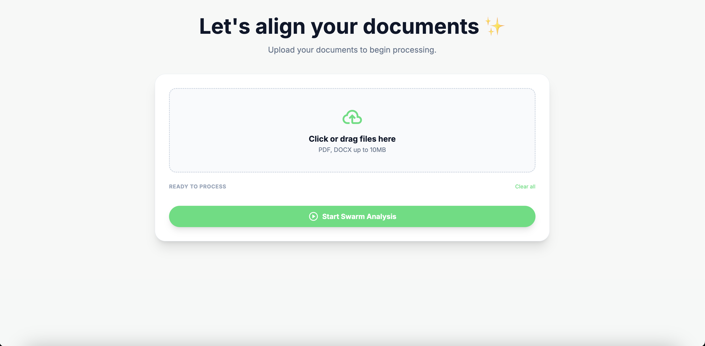
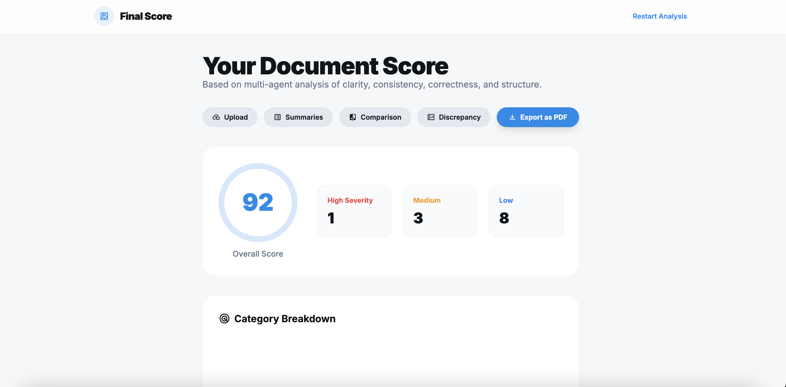

# 📄 DocuAnalyze – Multi-Agent Document Intelligence


DocuAnalyze is an advanced AI-powered document processing system built using **Flask**, **Transformers**, and a multi-step workflow.  
It intelligently extracts text, summarizes documents, compares versions, detects discrepancies, and generates a final report score — all through a clean, modern UI.

try it yourself(https://docuanalyze1.onrender.com/)
---

## 🚀 Features

### **1️⃣ Smart Upload System**
- Upload one or multiple PDF/DOCX files  
- Drag-and-drop support  
- Real-time file chip display  

### **2️⃣ AI Summaries (Step 1)**
Uses a **Transformer-based Fast Summarizer** (DistilBART / Pegasus / T5 Small) to generate:
- Clean, paragraph-based summaries  
- Key insights  
- Natural-sounding output  

### **3️⃣ Document Comparison (Step 2)**
- Compares **Original vs AI-Modified** versions  
- Highlights differences  
- Side-by-side synchronized document viewer  
- Match vs Difference statistics  

### **4️⃣ Discrepancy Detector (Step 3)**
- Detects structural, semantic, tone, and factual issues  
- Page number + bounding boxes  
- Interactive minimap navigation  
- Issue grouping by severity + category  

### **5️⃣ Final Score Report (Step 4)**
- Overall quality score  
- Severity breakdown (high/medium/low)  
- Radar chart visualization  
- Export to PDF (under development)  

---
## 🖼 Preview Screenshots
### 🔹 Upload Page

### 🔹 Final Score Report


## 🧠 AI Pipeline

### ✔ Text Extraction  
Readable text extracted from uploaded PDF/DOCX files.

### ✔ AI-Enhanced Rewrite  
Original text → Improved “AI Updated Version”.

### ✔ Fast Transformer Summaries  
Powered by models like:

### ✔ Difference Detection  
- Lexical diff  
- Phrase changes  
- Semantic drift  
- AI modifications  

---

## 🗂 Tech Stack

| Component | Technology |
|----------|------------|
| Backend | Flask (Python) |
| AI Models | HuggingFace Transformers |
| Frontend | HTML + TailwindCSS |
| Charts | Chart.js |
| Difference Engine | Custom Python diff |
| File Handling | werkzeug / form-data |

---

## 📦 Installation & Setup

### **1️⃣ Clone the repository**
```bash
git clone https://github.com/your-username/DocuAnalyze.git
cd DocuAnalyze
```
### **2️⃣ Install dependencies**
```bash
pip install -r requirements.txt
```
### **3️⃣ Run the server**
```bash
python app.py
```
### **4️⃣ Open in browser**
```bash
http://localhost:5000
```
## 👥 TEAM
### Bhavesh

### Kush Maurya

### Ubaid Khan

### Ved Sharma
